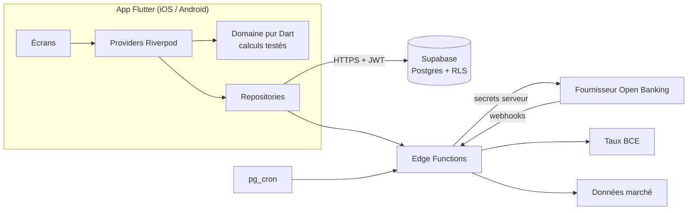

# 2. Architecture

## Vue d'ensemble

Principes : le **domaine** (patrimoine net, % millionnaire, flux, score, projection) est
du Dart pur, sans Flutter ni réseau, donc testable à 100 %. L'UI ne parle qu'aux
**providers**, qui ne parlent qu'aux **interfaces de repository**. Aujourd'hui
`DemoPortfolioRepository`, demain `SupabasePortfolioRepository`, sans toucher aux écrans.

Aucun secret dans l'app : clés Open Banking, clé `service_role` Supabase et clés de marché
restent dans les Edge Functions. L'app n'a que l'URL et la clé publique `anon`, protégées
par les politiques RLS.

## Backend : comparaison

| Critère | Supabase (retenu) | Firebase | NestJS maison |
|--------|-------------------|----------|---------------|
| Coût de départ | Offre gratuite | Offre gratuite, mais les Cloud Functions exigent le forfait Blaze (carte bancaire) | Hébergement payant |
| Données | Postgres relationnel : idéal pour comptes / transactions / snapshots | NoSQL, jointures et agrégats pénibles | Au choix |
| Sécurité | Row Level Security par utilisateur | Règles Firestore | À écrire |
| Auth Apple / Google | Intégrée | Intégrée | À intégrer |
| Code serveur | Edge Functions (TypeScript / Deno) | Cloud Functions | Total |
| Tâches planifiées | pg_cron | Cloud Scheduler | À héberger |
| Région UE (RGPD) | Oui | Oui | Selon hébergeur |
| Verrouillage | Faible (Postgres standard) | Fort | Nul |

Points d'attention Supabase gratuit (à vérifier, conditions évolutives) : projet mis en
pause après une période d'inactivité, quotas de base et de fonctions, pas de sauvegardes
avancées. Suffisant pour le développement et un bêta-test.

## Open Banking : fournisseurs à évaluer

Aucun fournisseur ne couvre le monde entier. L'architecture prévoit une **interface
`BankingProvider`** côté serveur et un fournisseur par région. Informations issues de mes
connaissances, **à vérifier** (tarifs, conditions, couverture changent souvent) :

| Fournisseur | Force | Remarques |
|-------------|-------|-----------|
| Powens (ex-Budget Insight) | France, données patrimoniales (assurance-vie, PEA) | Commercial, contrat requis |
| Bridge (groupe BPCE) | Couverture bancaire française | Commercial |
| Tink (Visa) | Europe large | Console et sandbox gratuites, production payante |
| Yapily | Europe / Royaume-Uni, API PSD2 | B2B |
| TrueLayer | Royaume-Uni / Europe | B2B |
| Plaid | États-Unis / Canada surtout | Couverture France limitée |
| GoCardless Bank Account Data (ex-Nordigen) | Était gratuit | Nouvelles inscriptions possiblement fermées : à vérifier |
| Enable Banking | Europe | Un mode restreint gratuit pour relier ses propres comptes existerait : à vérifier |

Flux prévu : l'app demande à une Edge Function un lien de consentement → l'utilisateur
s'authentifie **chez sa banque** (jamais dans l'app) → le fournisseur rappelle un
webhook → la fonction stocke le jeton côté serveur (chiffré) et lance la synchro →
les transactions arrivent en base → l'app se met à jour. Le consentement PSD2 expire
(souvent 90 à 180 jours) : statut `expired` et parcours de reconnexion.

Réglementation : l'agrégation relève du service d'information sur les comptes (PSD2) ;
passer par un prestataire agréé évite d'être agréé soi-même. PSD3 / PSR et le règlement
FiDA sont en cours d'adoption : impact à vérifier.

## Synchronisation

- Déclencheurs : ouverture de l'app (si > 6 h), glisser pour rafraîchir, bouton
  « Synchroniser maintenant », webhook du fournisseur, tâche quotidienne.
- Chaque synchro est tracée dans `sync_jobs` (statut, erreur, durée).
- Idempotence : identifiant externe unique par transaction.
- Snapshot quotidien du patrimoine par pg_cron (historique même sans ouverture de l'app).

## Données de marché

- **Change** : taux de référence quotidiens de la BCE (gratuits, ~30 devises), stockés
  datés dans `fx_rates`.
- **Crypto** : API gratuite avec clé et attribution (ex. CoinGecko Demo) : à vérifier.
- **Actions / ETF** : les offres gratuites sont limitées et leurs licences restreignent
  souvent l'affichage. MVP : valeur de position remontée par l'agrégateur ou saisie ;
  cours détaillés en V2.
- Chaque prix est stocké avec sa source et sa date, affichées dans l'app.

## Sécurité

Authentification : Apple, Google, e-mail (lien magique) via Supabase Auth ; verrouillage
local par biométrie avec code de secours ; jetons dans le Keychain / Keystore
(`flutter_secure_storage`). Transport HTTPS uniquement. RLS sur toutes les tables.
Cache local chiffré (SQLCipher) au module hors ligne. Journal d'audit des actions
sensibles. Mode confidentialité. Aucun log de montant ou de libellé bancaire en
production. Suppression complète du compte en libre-service.

## Schéma de base de données (cible module 2)

Toutes les tables ont `user_id uuid` (sauf référentiels), une politique RLS
`user_id = auth.uid()`, `created_at` et `updated_at`. Montants en `bigint` d'unités
mineures + `currency char(3)`.

| Table | Rôle | Champs clés |
|-------|------|-------------|
| `profiles` | Préférences | reporting_currency, target_amount_minor, target_currency, locale |
| `institutions` | Référentiel banques | provider, external_id, name, country |
| `bank_connections` | Consentements | provider, status (active/expired/error), consent_expires_at ; jeton **uniquement** en Vault |
| `accounts` | Comptes | connection_id?, type, name, currency, balance_minor, balance_at, source |
| `transactions` | Opérations | account_id, external_id (unique), booked_at, amount_minor, description, merchant, category, is_user_categorized, status |
| `category_overrides` | Corrections apprises | merchant_key, category |
| `assets` | Biens et actifs manuels | class, name, value_minor, currency, valued_at, source |
| `liabilities` | Dettes | type, outstanding_minor, currency, secured_asset_id |
| `holdings` | Positions (V2) | account_id, symbol, quantity, cost_basis_minor |
| `price_quotes` | Cours datés | symbol, price_minor, currency, source, quoted_at |
| `fx_rates` | Taux datés | base, quote, rate, source, rate_date |
| `net_worth_snapshots` | Historique | snapshot_date, gross_minor, liabilities_minor, currency |
| `goals` | Objectifs | target_minor, currency, target_date |
| `sync_jobs` | Traçabilité | connection_id, status, started_at, finished_at, error_code |
| `consents` | RGPD | kind, version, granted_at, revoked_at |
| `audit_log` | Sécurité | action, metadata (sans donnée financière) |

Suppression de compte : cascade SQL + révocation des consentements chez le fournisseur.

## Environnements

`APP_ENV=development | staging | production` via `--dart-define`, un projet Supabase par
environnement, identifiants de bundle distincts (`.dev`, `.staging`) au module 7.
